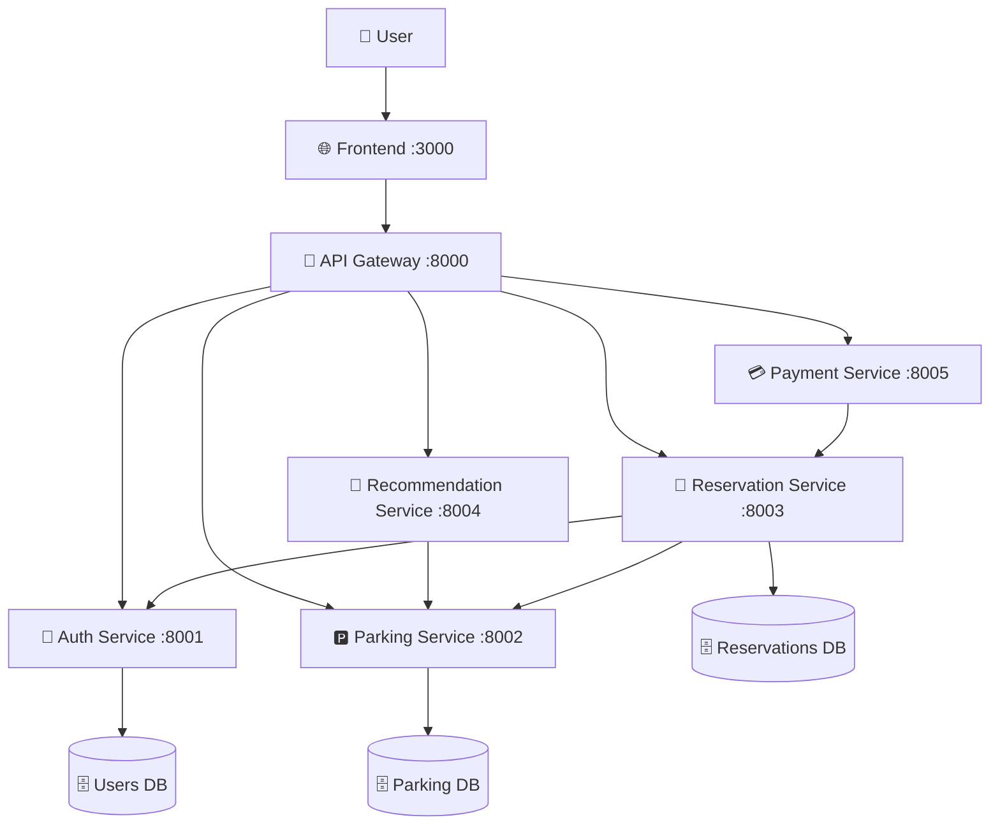

# Smart Parking System

[](https://github.com/hungdn1701/microservices-assignment-starter/stargazers)
[](https://github.com/hungdn1701/microservices-assignment-starter/network/members)
[](LICENSE)

> A comprehensive microservices-based Smart Parking System that automates parking space management, reservations, and payments in urban areas. The system provides real-time parking availability, location-based recommendations, and seamless booking experiences for users.

> **New to this repo?** See the [Quick Start Guide](#-quick-start) below for setup instructions.

---

## 👥 Team Members

| Name | Student ID | Role | Contribution |
|------|------------|------|-------------|
| [Your Name] | [Student ID] | Full Stack Developer | All services implementation |

---

## 🏢 Business Process

The Smart Parking System automates the entire parking lifecycle in urban environments:

**Domain**: Urban parking management and reservation system
**Actors**: Drivers, Parking operators, System administrators
**Scope**: Real-time parking space management, booking, and payment processing

### Key Business Processes:
1. **User Registration & Authentication** - Secure user onboarding with profile management
2. **Parking Discovery** - Location-based parking recommendations with real-time availability
3. **Reservation Management** - Advanced booking with time slots and automatic seat assignment
4. **Check-in/Check-out** - Seamless parking session management with cost calculation
5. **Payment Processing** - Automated billing with multiple payment methods and discounts
6. **Analytics & Reporting** - User statistics and parking utilization insights

---

## 🏗 Architecture



| Component | Responsibility | Tech Stack | Port |
|-----------|----------------|------------|------|
| **Frontend** | React-based user interface with real-time updates | React, Vite, CSS | 3000 |
| **API Gateway** | Request routing, authentication, load balancing | FastAPI, httpx | 8000 |
| **Auth Service** | User management, JWT authentication, profiles | FastAPI, SQLAlchemy, JWT | 8001 |
| **Parking Service** | Parking locations, seat management, availability | FastAPI, SQLAlchemy | 8002 |
| **Reservation Service** | Booking management, check-in/out, statistics | FastAPI, SQLAlchemy | 8003 |
| **Recommendation Service** | Location-based recommendations, smart scoring | FastAPI, Haversine | 8004 |
| **Payment Service** | Cost calculations, fees, discounts | FastAPI, Decimal | 8005 |

> Full documentation: [`docs/architecture.md`](docs/architecture.md) · [`docs/analysis-and-design.md`](docs/analysis-and-design.md)

---

## 🚀 Quick Start

### Prerequisites
- [Docker Desktop](https://docs.docker.com/get-docker/) (includes Docker Compose)
- [Git](https://git-scm.com/)
- At least 4GB RAM available for Docker
- Ports 3000, 8000-8005 available on your system

### Option 1: One-Command Setup (Recommended)

```bash
# Clone the repository
git clone <your-repo-url>
cd Smart_Parking_System

# Build and start all services
docker-compose up --build
```

**⏱️ First-time setup takes 3-5 minutes** - Docker will:
1. Build all service images
2. Install dependencies
3. Initialize databases with Hanoi parking data
4. Start all services in correct order

### Option 2: Step-by-Step Setup

```bash
# 1. Clone and navigate
git clone <your-repo-url>
cd Smart_Parking_System

# 2. Build all images first (optional but recommended)
docker-compose build

# 3. Start all services
docker-compose up

# 4. Or run in background (detached mode)
docker-compose up -d
```

### 🔍 Verify Installation

Once all services are running, verify each component:

```bash
# Check all services status
docker-compose ps

# Test individual services
curl http://localhost:8000/health      # API Gateway
curl http://localhost:8001/health      # Auth Service
curl http://localhost:8002/health      # Parking Service
curl http://localhost:8003/health      # Reservation Service
curl http://localhost:8004/health      # Recommendation Service
curl http://localhost:8005/health      # Payment Service

# Frontend should be accessible at:
# http://localhost:3000
```

### 📱 Access the Application

| Component | URL | Description |
|-----------|-----|-------------|
| **Frontend** | http://localhost:3000 | Main user interface |
| **API Gateway** | http://localhost:8000 | Unified API endpoint |
| **API Documentation** | http://localhost:8000/docs | Interactive API docs |
| **Auth Service** | http://localhost:8001/docs | Auth API docs |
| **Parking Service** | http://localhost:8002/docs | Parking API docs |
| **Reservation Service** | http://localhost:8003/docs | Reservation API docs |
| **Recommendation Service** | http://localhost:8004/docs | Recommendation API docs |
| **Payment Service** | http://localhost:8005/docs | Payment API docs |

---

## 🐳 Docker Commands

### Basic Operations

```bash
# Start all services
docker-compose up

# Start in background (detached)
docker-compose up -d

# Stop all services
docker-compose down

# Stop and remove volumes (clean slate)
docker-compose down -v

# Rebuild and start (after code changes)
docker-compose up --build

# View logs from all services
docker-compose logs

# View logs from specific service
docker-compose logs auth-service
docker-compose logs parking-service
docker-compose logs frontend

# Follow logs in real-time
docker-compose logs -f

# Restart a specific service
docker-compose restart auth-service
```

### Development Commands

```bash
# Build specific service
docker-compose build auth-service

# Run a command in a running container
docker-compose exec auth-service bash

# Scale a service (run multiple instances)
docker-compose up --scale parking-service=2

# Check service status
docker-compose ps

# View resource usage
docker stats
```

### Troubleshooting Commands

```bash
# Remove all containers and start fresh
docker-compose down
docker-compose up --build

# Clean up Docker system (removes unused containers, networks, images)
docker system prune

# Remove all volumes (WARNING: deletes all data)
docker-compose down -v
docker volume prune

# Check Docker logs for specific container
docker logs <container_name>

# Access container shell for debugging
docker-compose exec <service_name> bash
```

---

## 🔧 Configuration

### Environment Variables

Create a `.env` file in the root directory (optional):

```bash
# Database URLs
AUTH_DB_URL=sqlite:///./auth.db
PARKING_DB_URL=sqlite:///./parking.db
RESERVATION_DB_URL=sqlite:///./reservation.db

# JWT Configuration
SECRET_KEY=your-secret-key-here
ALGORITHM=HS256

# Service URLs (for Docker networking)
AUTH_SERVICE_URL=http://auth-service:8001
PARKING_SERVICE_URL=http://parking-service:8002
RESERVATION_SERVICE_URL=http://reservation-service:8003
RECOMMENDATION_SERVICE_URL=http://recommendation-service:8004
PAYMENT_SERVICE_URL=http://payment-service:8005

# Frontend Configuration
VITE_API_URL=http://localhost:8000
```

### Port Configuration

Default ports used by the system:

| Service | Internal Port | External Port | Configurable |
|---------|---------------|---------------|--------------|
| Frontend | 3000 | 3000 | ✅ |
| API Gateway | 8000 | 8000 | ✅ |
| Auth Service | 8001 | 8001 | ✅ |
| Parking Service | 8002 | 8002 | ✅ |
| Reservation Service | 8003 | 8003 | ✅ |
| Recommendation Service | 8004 | 8004 | ✅ |
| Payment Service | 8005 | 8005 | ✅ |

To change ports, modify the `docker-compose.yml` file:

```yaml
services:
  auth-service:
    ports:
      - "9001:8001"  # External:Internal
```

---

## 🚨 Troubleshooting

### Common Issues and Solutions

#### 1. Port Already in Use
```bash
# Error: Port 8000 is already in use
# Solution: Stop the conflicting service or change ports

# Find what's using the port (Linux/Mac)
lsof -i :8000
# or on Windows
netstat -ano | findstr :8000

# Kill the process or change port in docker-compose.yml
```

#### 2. Services Not Starting
```bash
# Check service logs
docker-compose logs <service-name>

# Common causes:
# - Missing dependencies in requirements.txt
# - Syntax errors in code
# - Database connection issues
# - Port conflicts
```

#### 3. Database Issues
```bash
# Reset all databases
docker-compose down -v
docker-compose up --build

# Check database files
ls -la services/*/*.db
```

#### 4. Frontend Not Loading
```bash
# Check if frontend service is running
docker-compose ps frontend

# Check frontend logs
docker-compose logs frontend

# Rebuild frontend
docker-compose build frontend
docker-compose up frontend
```

#### 5. Service Communication Issues
```bash
# Services can't communicate with each other
# Check Docker network
docker network ls
docker network inspect <network_name>

# Verify service names in code match docker-compose.yml
```

### Performance Issues

```bash
# Check resource usage
docker stats

# Increase Docker memory limit in Docker Desktop settings
# Recommended: At least 4GB RAM

# Clean up unused resources
docker system prune -a
```

### Development Mode Issues

```bash
# Code changes not reflecting
# Make sure volumes are properly mounted in docker-compose.yml

# For Python services, ensure auto-reload is enabled
# Check if --reload flag is used in Dockerfile CMD

# For frontend, ensure Vite dev server is running with --host 0.0.0.0
```

---

## 📊 Monitoring

### Health Checks

```bash
# Quick health check script
#!/bin/bash
services=("8000" "8001" "8002" "8003" "8004" "8005")
for port in "${services[@]}"; do
  echo "Checking localhost:$port/health"
  curl -s "http://localhost:$port/health" || echo "❌ Service on port $port is down"
done
```

### Logs Monitoring

```bash
# Monitor all services in real-time
docker-compose logs -f

# Monitor specific services
docker-compose logs -f auth-service parking-service

# Save logs to file
docker-compose logs > system.log 2>&1
```

### Resource Monitoring

```bash
# Check container resource usage
docker stats --format "table {{.Container}}\t{{.CPUPerc}}\t{{.MemUsage}}\t{{.NetIO}}"

# Check disk usage
docker system df
```

---
cd services/auth-service
pip install -r requirements.txt
uvicorn main:app --host 0.0.0.0 --port 8001 --reload

# Terminal 2 - Parking Service  
cd services/parking-service
pip install -r requirements.txt
uvicorn main:app --host 0.0.0.0 --port 8002 --reload

# Terminal 3 - Reservation Service
cd services/reservation-service
pip install -r requirements.txt
uvicorn main:app --host 0.0.0.0 --port 8003 --reload

# Terminal 4 - Recommendation Service
cd services/recommendation-service
pip install -r requirements.txt
uvicorn main:app --host 0.0.0.0 --port 8004 --reload

# Terminal 5 - Payment Service
cd services/payment-service
pip install -r requirements.txt
uvicorn main:app --host 0.0.0.0 --port 8005 --reload

# Terminal 6 - Gateway
cd gateway
pip install -r requirements.txt
uvicorn main:app --host 0.0.0.0 --port 8000 --reload

# Terminal 7 - Frontend
cd frontend
npm install
npm run dev
```

### 🔍 Verify Installation

```bash
# Check all services are running
curl http://localhost:8000/health      # API Gateway
curl http://localhost:8001/health      # Auth Service
curl http://localhost:8002/health      # Parking Service
curl http://localhost:8003/health      # Reservation Service
curl http://localhost:8004/health      # Recommendation Service
curl http://localhost:8005/health      # Payment Service

# Check frontend
curl http://localhost:3000             # Frontend
```

### 🌐 Access the Application

- **Frontend Application**: http://localhost:3000
- **API Gateway**: http://localhost:8000
- **API Documentation**: 
  - Gateway: http://localhost:8000/docs
  - Auth Service: http://localhost:8001/docs
  - Parking Service: http://localhost:8002/docs
  - Reservation Service: http://localhost:8003/docs
  - Recommendation Service: http://localhost:8004/docs
  - Payment Service: http://localhost:8005/docs

---

## 🎯 Features

### 🔐 User Management
- **Registration & Login**: Secure JWT-based authentication
- **Profile Management**: Personal information and avatar upload
- **Vehicle Management**: Multiple vehicle support with default selection
- **Payment Methods**: Credit/debit cards and e-wallet integration
- **Favorite Locations**: Save frequently used parking spots

### 🅿️ Parking Management
- **Real-time Availability**: Live parking space status updates
- **Location Data**: 9 pre-configured parking locations in Hanoi
- **Seat Layout**: Intelligent grid-based seat arrangement
- **Time-based Booking**: Reserve specific time slots
- **Conflict Prevention**: Automatic booking conflict detection

### 🎯 Smart Recommendations
- **Location-based Search**: GPS-powered parking discovery
- **Distance Calculations**: Accurate Haversine distance formula
- **Smart Scoring**: Multi-factor recommendation algorithm
- **Flexible Filtering**: Distance, price, and availability filters
- **Walking Time**: Estimated walking duration

### 📅 Reservation System
- **Quick Booking**: One-click parking reservation
- **Advanced Booking**: Detailed reservation with vehicle selection
- **Check-in/Check-out**: QR code or manual session management
- **Real-time Status**: Live reservation status updates
- **History Tracking**: Complete booking history

### 💳 Payment Processing
- **Automatic Calculations**: Duration-based cost computation
- **Fee Management**: Service fees, taxes, and processing charges
- **Discount System**: Promotional codes and member benefits
- **Detailed Receipts**: Comprehensive cost breakdowns

### 📊 Analytics & Statistics
- **Usage Statistics**: Personal parking analytics
- **Spending Tracking**: Total costs and time spent
- **Favorite Analysis**: Most visited parking locations
- **Performance Metrics**: System-wide usage insights

---

## 🗄 Sample Data

The system comes pre-loaded with 9 parking locations in Hanoi:

1. **Bãi đỗ xe Tràng Tiền Plaza** - Hoàn Kiếm District (200 slots, 20,000 VND/hour)
2. **Bãi gửi xe Vincom Bà Triệu** - Hai Bà Trưng District (300 slots, 25,000 VND/hour)
3. **Bãi đỗ xe Hồ Gươm** - Hoàn Kiếm District (150 slots, 30,000 VND/hour)
4. **Bãi gửi xe Times City** - Hai Bà Trưng District (500 slots, 15,000 VND/hour)
5. **Bãi đỗ xe Keangnam** - Nam Từ Liêm District (400 slots, 20,000 VND/hour)
6. **Bãi gửi xe Lotte Center** - Ba Đình District (350 slots, 25,000 VND/hour)
7. **Bãi đỗ xe Big C Thăng Long** - Cầu Giấy District (450 slots, 10,000 VND/hour)
8. **Bãi gửi xe Royal City** - Thanh Xuân District (600 slots, 15,000 VND/hour)
9. **Bãi gửi xe Học viện Bưu chính Viễn thông** - Hà Đông District (250 slots, 10,000 VND/hour)

---

## 🧪 Testing the System

### 1. User Registration
```bash
curl -X POST "http://localhost:8000/register" \
  -H "Content-Type: application/json" \
  -d '{
    "email": "test@example.com",
    "password": "password123",
    "full_name": "Test User"
  }'
```

### 2. Get Parking Recommendations
```bash
curl -X GET "http://localhost:8000/recommendations?lat=21.0285&lng=105.8542&sort_by=distance"
```

### 3. View Available Parkings
```bash
curl -X GET "http://localhost:8000/parkings"
```

### 4. Check Seat Availability
```bash
curl -X GET "http://localhost:8000/parkings/1/seats?start_time=2024-01-01T10:00:00Z&end_time=2024-01-01T12:00:00Z"
```

---

## 🛠 Development

### Project Structure
```
Smart_Parking_System/
├── frontend/                    # React frontend application
├── gateway/                     # API Gateway service
├── services/
│   ├── auth-service/           # Authentication & user management
│   ├── parking-service/        # Parking locations & seat management
│   ├── reservation-service/    # Booking & reservation management
│   ├── recommendation-service/ # Location-based recommendations
│   └── payment-service/        # Payment calculations & processing
├── docs/
│   └── api-specs/              # OpenAPI 3.0 specifications
├── docker-compose.yml          # Multi-container orchestration
└── README.md                   # This file
```

### Service Dependencies
```
Frontend → API Gateway → {
    Auth Service (User management)
    Parking Service (Parking data)
    Reservation Service (Bookings) → {
        Auth Service (User validation)
        Parking Service (Seat booking)
    }
    Recommendation Service (Suggestions) → Parking Service
    Payment Service (Calculations)
}
```

### Environment Variables
Each service uses environment variables for configuration:
- `SECRET_KEY`: JWT signing key
- `DATABASE_URL`: Database connection string
- `PYTHONPATH`: Python module path

---

## 🚨 Troubleshooting

### Common Issues

**Services won't start:**
```bash
# Check if ports are available
netstat -tulpn | grep :8000
netstat -tulpn | grep :3000

# Stop conflicting processes
docker-compose down
```

**Database issues:**
```bash
# Remove old database files
rm services/auth-service/auth.db
rm services/parking-service/parking.db
rm services/reservation-service/reservation.db

# Restart services to recreate databases
docker-compose up --build
```

**Frontend build errors:**
```bash
cd frontend
rm -rf node_modules package-lock.json
npm install
npm run dev
```

**Authentication errors:**
- Clear browser localStorage
- Check JWT token expiration
- Verify SECRET_KEY consistency across services

### Service Health Checks
```bash
# Check individual service health
curl http://localhost:8001/health  # Auth
curl http://localhost:8002/health  # Parking
curl http://localhost:8003/health  # Reservation
curl http://localhost:8004/health  # Recommendation
curl http://localhost:8005/health  # Payment
```

---

## API Documentation

- [Service A — OpenAPI Spec](docs/api-specs/service-a.yaml)
- [Service B — OpenAPI Spec](docs/api-specs/service-b.yaml)

---

## License

This project uses the [MIT License](LICENSE).

> Template by [Hung Dang](https://github.com/hungdn1701) · [Template guide](GETTING_STARTED.md)

