# Analysis and Design — Business Process Automation Solution

> **Goal**: Analyze a specific business process and design a service-oriented automation solution (SOA/Microservices).
> Scope: 4–6 week assignment — focus on **one business process**, not an entire system.

**References:**
1. *Service-Oriented Architecture: Analysis and Design for Services and Microservices* — Thomas Erl (2nd Edition)
2. *Microservices Patterns: With Examples in Java* — Chris Richardson
3. *Bài tập — Phát triển phần mềm hướng dịch vụ* — Hung Dang (available in Vietnamese)

---

## Part 1 — Analysis Preparation

### 1.1 Business Process Definition

Describe or diagram the high-level Business Process to be automated.

- **Domain**: *(fill in)*
- **Business Process**: *(fill in)*
- **Actors**: *(fill in)*
- **Scope**: *(fill in)*

**Process Diagram:**

*(Insert BPMN, flowchart, or image into `docs/asset/` and reference here)*

### 1.2 Existing Automation Systems

List existing systems, databases, or legacy logic related to this process.

| System Name | Type | Current Role | Interaction Method |
|-------------|------|--------------|-------------------|
|             |      |              |                   |

> If none exist, state: *"None — the process is currently performed manually."*

### 1.3 Non-Functional Requirements

Non-functional requirements serve as input for identifying Utility Service and Microservice Candidates in step 2.7.

| Requirement    | Description |
|----------------|-------------|
| Performance    |             |
| Security       |             |
| Scalability    |             |
| Availability   |             |

---

## Part 2 — REST/Microservices Modeling

### 2.1 Decompose Business Process & 2.2 Filter Unsuitable Actions

Decompose the process from 1.1 into granular actions. Mark actions unsuitable for service encapsulation.

| # | Action | Actor | Description | Suitable? |
|---|--------|-------|-------------|-----------|
|   |        |       |             | ✅ / ❌    |

> Actions marked ❌: manual-only, require human judgment, or cannot be encapsulated as a service.

### 2.3 Entity Service Candidates

Identify business entities and group reusable (agnostic) actions into Entity Service Candidates.

| Entity | Service Candidate | Agnostic Actions |
|--------|-------------------|------------------|
|        |                   |                  |

### 2.4 Task Service Candidate

Group process-specific (non-agnostic) actions into a Task Service Candidate.

| Non-agnostic Action | Task Service Candidate |
|---------------------|------------------------|
|                     |                        |

### 2.5 Identify Resources

Map entities/processes to REST URI Resources.

| Entity / Process | Resource URI |
|------------------|--------------|
|                  |              |

### 2.6 Associate Capabilities with Resources and Methods

| Service Candidate | Capability | Resource | HTTP Method |
|-------------------|------------|----------|-------------|
|                   |            |          |             |

### 2.7 Utility Service & Microservice Candidates

Based on Non-Functional Requirements (1.3) and Processing Requirements, identify cross-cutting utility logic or logic requiring high autonomy/performance.

| Candidate | Type (Utility / Microservice) | Justification |
|-----------|-------------------------------|---------------|
|           |                               |               |

### 2.8 Service Composition Candidates

Interaction diagram showing how Service Candidates collaborate to fulfill the business process.

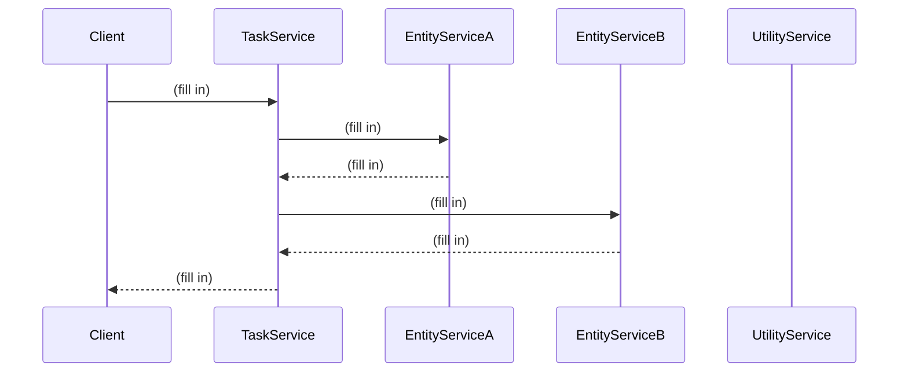

---

## Part 3 — Service-Oriented Design

### 3.1 Uniform Contract Design

Service Contract specification for each service. Full OpenAPI specs:
- [`docs/api-specs/service-a.yaml`](api-specs/service-a.yaml)
- [`docs/api-specs/service-b.yaml`](api-specs/service-b.yaml)

**Service A:**

| Endpoint | Method | Media Type | Response Codes |
|----------|--------|------------|----------------|
|          |        |            |                |

**Service B:**

| Endpoint | Method | Media Type | Response Codes |
|----------|--------|------------|----------------|
|          |        |            |                |

### 3.2 Service Logic Design

Internal processing flow for each service.

**Service A:**

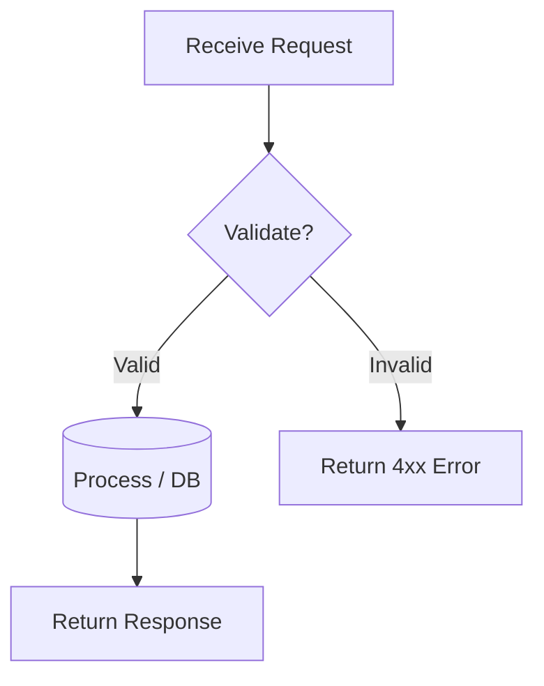

**Service B:**

---

# Smart Parking System - Analysis and Design Documentation

## Part 1 — Analysis Preparation

### 1.1 Business Process Definition

- **Domain**: Smart Parking Management and Reservation System
- **Business Process**: Automated parking space discovery, reservation, and payment
- **Actors**: 
  - End Users (Drivers looking for parking)
  - System Administrators (Parking lot managers)
  - Payment Processors
- **Scope**: 
  - User registration and authentication
  - Parking lot and seat management
  - Real-time seat availability tracking
  - Smart parking recommendations based on location
  - Online reservation and payment
  - Check-in/Check-out management
  - User profile and preferences management

**Process Diagram:**

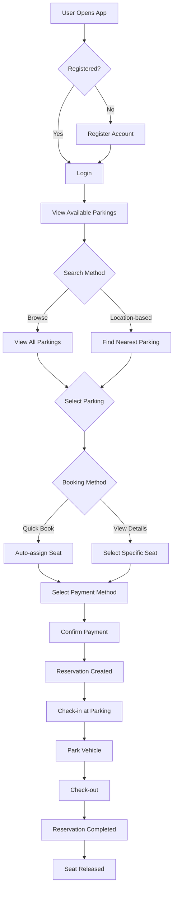

### 1.2 Existing Automation Systems

| System Name | Type | Current Role | Interaction Method |
|-------------|------|--------------|-------------------|
| None | - | - | - |

> The process is currently performed manually or through basic parking management systems without integrated online booking.

### 1.3 Non-Functional Requirements

| Requirement    | Description |
|----------------|-------------|
| **Performance** | - Response time < 2 seconds for search queries - Support 100+ concurrent users - Real-time seat availability updates |
| **Security** | - JWT-based authentication - Password encryption (bcrypt) - Secure payment information storage - HTTPS for all communications |
| **Scalability** | - Microservices architecture for independent scaling - Database per service pattern - Horizontal scaling capability |
| **Availability** | - 99.9% uptime target - Health check endpoints - Graceful error handling - Service redundancy support |
| **Usability** | - Responsive web interface - Intuitive booking flow - Multi-language support (future) - Mobile-friendly design |
| **Maintainability** | - Clean code architecture - Comprehensive API documentation - Containerized deployment - Automated testing (future) |

---

## Part 2 — REST/Microservices Modeling

### 2.1 Decompose Business Process & 2.2 Filter Unsuitable Actions

| # | Action | Actor | Description | Suitable? |
|---|--------|-------|-------------|-----------|
| 1 | Register account | User | Create new user account with email and password | ✅ |
| 2 | Login | User | Authenticate user and generate JWT token | ✅ |
| 3 | Update profile | User | Modify user information (name, phone, avatar) | ✅ |
| 4 | Add vehicle | User | Register vehicle information | ✅ |
| 5 | Add payment method | User | Store payment method details | ✅ |
| 6 | Browse parking lots | User | View list of available parking lots | ✅ |
| 7 | Search by location | User | Find nearest parking based on GPS coordinates | ✅ |
| 8 | View parking details | User | See parking information and seat layout | ✅ |
| 9 | Check seat availability | System | Real-time availability checking | ✅ |
| 10 | Select seat | User | Choose specific parking seat | ✅ |
| 11 | Quick book | User | Auto-assign available seat | ✅ |
| 12 | Calculate payment | System | Compute parking fee based on duration | ✅ |
| 13 | Process payment | System | Handle payment transaction | ✅ |
| 14 | Create reservation | System | Generate booking record | ✅ |
| 15 | Send confirmation | System | Notify user of successful booking | ✅ |
| 16 | Check-in | User | Mark arrival at parking lot | ✅ |
| 17 | Park vehicle | User | Physical parking action | ❌ |
| 18 | Check-out | User | Mark departure from parking lot | ✅ |
| 19 | Release seat | System | Free up parking seat | ✅ |
| 20 | Update availability | System | Refresh parking slot count | ✅ |
| 21 | Add to favorites | User | Save frequently used parking lots | ✅ |
| 22 | Get recommendations | System | Suggest best parking options | ✅ |
| 23 | View reservation history | User | See past bookings | ✅ |
| 24 | Cancel reservation | User | Cancel active booking | ✅ |

> Action #17 marked ❌: Physical action that cannot be automated through software.

### 2.3 Entity Service Candidates

| Entity | Service Candidate | Agnostic Actions |
|--------|-------------------|------------------|
| User | Auth Service | Register, Login, Get Profile, Update Profile, Manage Vehicles, Manage Payment Methods, Manage Favorites |
| Parking | Parking Service | Get All Parkings, Get Parking Details, Get Seats, Book Seat, Release Seat, Update Availability |
| Reservation | Reservation Service | Create Reservation, Get Reservations, Check-in, Check-out, Cancel Reservation, Quick Book |
| Payment | Payment Service | Calculate Payment, Process Payment |
| Recommendation | Recommendation Service | Get Nearest Parkings, Calculate Distance, Score Parkings |

### 2.4 Task Service Candidate

| Non-agnostic Action | Task Service Candidate |
|---------------------|------------------------|
| Complete booking flow (search → select → pay → confirm) | Booking Orchestration (handled by Gateway) |
| User onboarding (register → add vehicle → add payment) | Setup Wizard (handled by Frontend) |
| Smart recommendation with filters | Recommendation Service |

### 2.5 Identify Resources

| Entity / Process | Resource URI |
|------------------|--------------|
| User Authentication | `/register`, `/login` |
| User Profile | `/profile` |
| Vehicles | `/vehicles`, `/vehicles/{id}` |
| Payment Methods | `/payment-methods`, `/payment-methods/{id}` |
| Favorite Parkings | `/favorites`, `/favorites/{id}` |
| Parkings | `/parkings`, `/parkings/{id}` |
| Seats | `/parkings/{id}/seats`, `/seats/{id}` |
| Reservations | `/reservations`, `/reservations/{id}` |
| Quick Booking | `/reservations/quick-book/{parking_id}` |
| Check-in/out | `/reservations/{id}/check-in`, `/reservations/{id}/check-out` |
| Payment Calculation | `/payment/calculate` |
| Recommendations | `/recommendations` |
| Health Check | `/health` |

### 2.6 Associate Capabilities with Resources and Methods

| Service Candidate | Capability | Resource | HTTP Method |
|-------------------|------------|----------|-------------|
| Auth Service | Register user | `/register` | POST |
| Auth Service | Login user | `/login` | POST |
| Auth Service | Get profile | `/profile` | GET |
| Auth Service | Update profile | `/profile` | PUT |
| Auth Service | List vehicles | `/vehicles` | GET |
| Auth Service | Add vehicle | `/vehicles` | POST |
| Auth Service | Update vehicle | `/vehicles/{id}` | PUT |
| Auth Service | Delete vehicle | `/vehicles/{id}` | DELETE |
| Auth Service | List payment methods | `/payment-methods` | GET |
| Auth Service | Add payment method | `/payment-methods` | POST |
| Auth Service | Update payment method | `/payment-methods/{id}` | PUT |
| Auth Service | Delete payment method | `/payment-methods/{id}` | DELETE |
| Auth Service | List favorites | `/favorites` | GET |
| Auth Service | Add favorite | `/favorites` | POST |
| Auth Service | Update favorite | `/favorites/{id}` | PUT |
| Auth Service | Remove favorite | `/favorites/{id}` | DELETE |
| Parking Service | List parkings | `/parkings` | GET |
| Parking Service | Get parking details | `/parkings/{id}` | GET |
| Parking Service | Get parking seats | `/parkings/{id}/seats` | GET |
| Parking Service | Book seat | `/seats/{id}/book` | POST |
| Parking Service | Release seat | `/seats/{id}/release` | POST |
| Parking Service | Update slots | `/parkings/{id}/slots` | PATCH |
| Reservation Service | List reservations | `/reservations` | GET |
| Reservation Service | Create reservation | `/reservations` | POST |
| Reservation Service | Quick book | `/reservations/quick-book/{parking_id}` | POST |
| Reservation Service | Get booked seats | `/reservations/booked-seats/{parking_id}` | GET |
| Reservation Service | Check-in | `/reservations/{id}/check-in` | POST |
| Reservation Service | Check-out | `/reservations/{id}/check-out` | POST |
| Reservation Service | Cancel reservation | `/reservations/{id}` | DELETE |
| Payment Service | Calculate payment | `/payment/calculate` | POST |
| Recommendation Service | Get recommendations | `/recommendations` | GET |

### 2.7 Utility Service & Microservice Candidates

| Candidate | Type | Justification |
|-----------|------|---------------|
| Auth Service | Microservice | High autonomy required for security. Handles sensitive user data and authentication. Independent scaling for user management. |
| Parking Service | Microservice | Core business entity. Requires independent deployment and scaling. Manages parking inventory. |
| Reservation Service | Microservice | Complex business logic for booking flow. Needs to coordinate with multiple services. High transaction volume. |
| Recommendation Service | Microservice | Computationally intensive (Haversine calculations, scoring). Can be scaled independently based on search traffic. |
| Payment Service | Utility Service | Cross-cutting concern for payment calculations. Stateless and reusable across different booking flows. |
| API Gateway | Utility Service | Cross-cutting concerns: routing, authentication, request aggregation. Single entry point for all clients. |

### 2.8 Service Composition Candidates

#### Booking Flow Composition

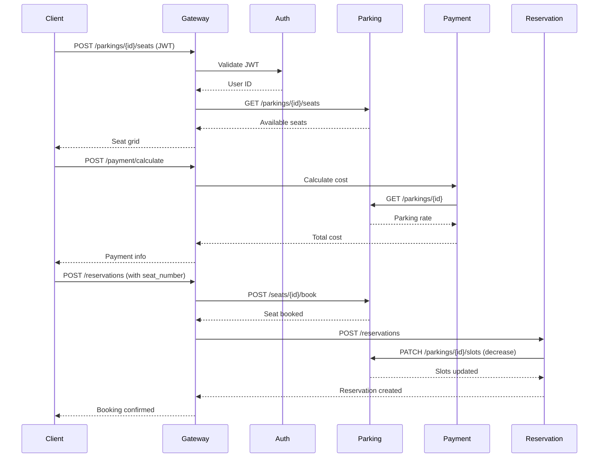

#### Quick Book Flow Composition

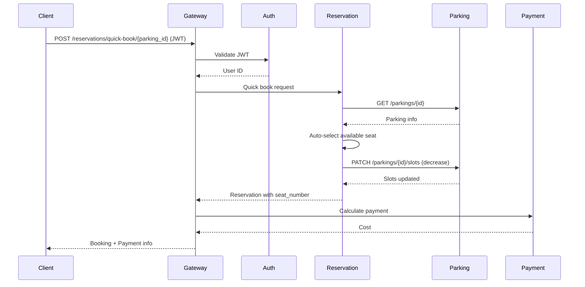

#### Checkout Flow Composition

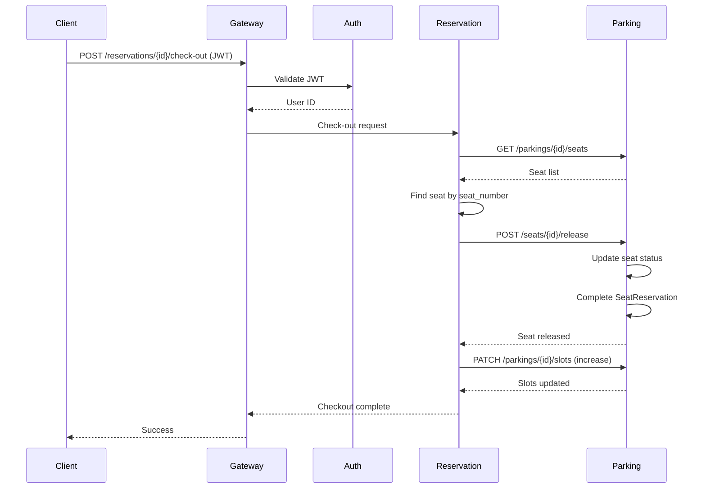

#### Recommendation Flow Composition

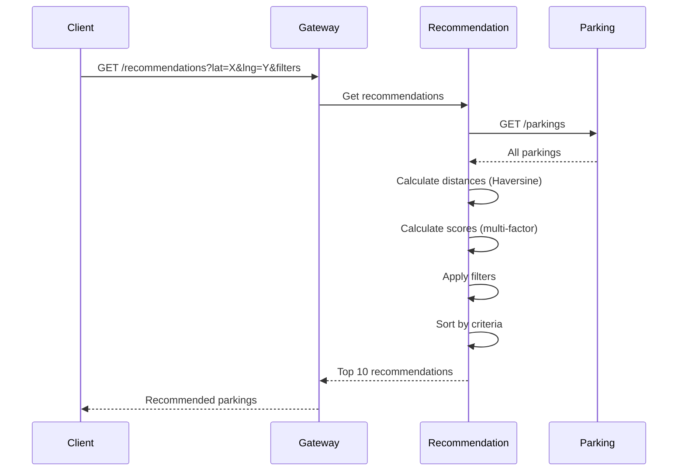

---

## Part 3 — Service-Oriented Design

### 3.1 Uniform Contract Design

Full OpenAPI specifications available in:
- [`docs/api-specs/auth-service.yaml`](api-specs/auth-service.yaml)
- [`docs/api-specs/service-a.yaml`](api-specs/service-a.yaml) (Template)
- [`docs/api-specs/service-b.yaml`](api-specs/service-b.yaml) (Template)

#### Auth Service Contract

| Endpoint | Method | Media Type | Response Codes |
|----------|--------|------------|----------------|
| `/health` | GET | application/json | 200 |
| `/register` | POST | application/json | 200, 400 |
| `/login` | POST | application/json | 200, 401 |
| `/profile` | GET | application/json | 200, 401 |
| `/profile` | PUT | application/json | 200, 401 |
| `/vehicles` | GET | application/json | 200, 401 |
| `/vehicles` | POST | application/json | 200, 400, 401 |
| `/vehicles/{id}` | PUT | application/json | 200, 401, 404 |
| `/vehicles/{id}` | DELETE | application/json | 200, 401, 404 |
| `/payment-methods` | GET | application/json | 200, 401 |
| `/payment-methods` | POST | application/json | 200, 401 |
| `/payment-methods/{id}` | PUT | application/json | 200, 401, 404 |
| `/payment-methods/{id}` | DELETE | application/json | 200, 401, 404 |
| `/favorites` | GET | application/json | 200, 401 |
| `/favorites` | POST | application/json | 200, 400, 401 |
| `/favorites/{id}` | PUT | application/json | 200, 401, 404 |
| `/favorites/{id}` | DELETE | application/json | 200, 401, 404 |

#### Parking Service Contract

| Endpoint | Method | Media Type | Response Codes |
|----------|--------|------------|----------------|
| `/health` | GET | application/json | 200 |
| `/parkings` | GET | application/json | 200 |
| `/parkings/{id}` | GET | application/json | 200, 404 |
| `/parkings/{id}/seats` | GET | application/json | 200, 404 |
| `/seats/{id}/book` | POST | application/json | 200, 400, 404 |
| `/seats/{id}/release` | POST | application/json | 200, 404 |
| `/parkings/{id}/slots` | PATCH | application/json | 200, 400, 404 |

#### Reservation Service Contract

| Endpoint | Method | Media Type | Response Codes |
|----------|--------|------------|----------------|
| `/health` | GET | application/json | 200 |
| `/reservations` | GET | application/json | 200, 401 |
| `/reservations` | POST | application/json | 200, 400, 401 |
| `/reservations/quick-book/{parking_id}` | POST | application/json | 200, 400, 401, 404 |
| `/reservations/booked-seats/{parking_id}` | GET | application/json | 200 |
| `/reservations/{id}/check-in` | POST | application/json | 200, 400, 401, 404 |
| `/reservations/{id}/check-out` | POST | application/json | 200, 400, 401, 404 |
| `/reservations/{id}` | DELETE | application/json | 200, 400, 401, 404 |

#### Payment Service Contract

| Endpoint | Method | Media Type | Response Codes |
|----------|--------|------------|----------------|
| `/health` | GET | application/json | 200 |
| `/payment/calculate` | POST | application/json | 200, 400 |

#### Recommendation Service Contract

| Endpoint | Method | Media Type | Response Codes |
|----------|--------|------------|----------------|
| `/health` | GET | application/json | 200 |
| `/recommendations` | GET | application/json | 200, 400 |

### 3.2 Service Logic Design

#### Auth Service Logic

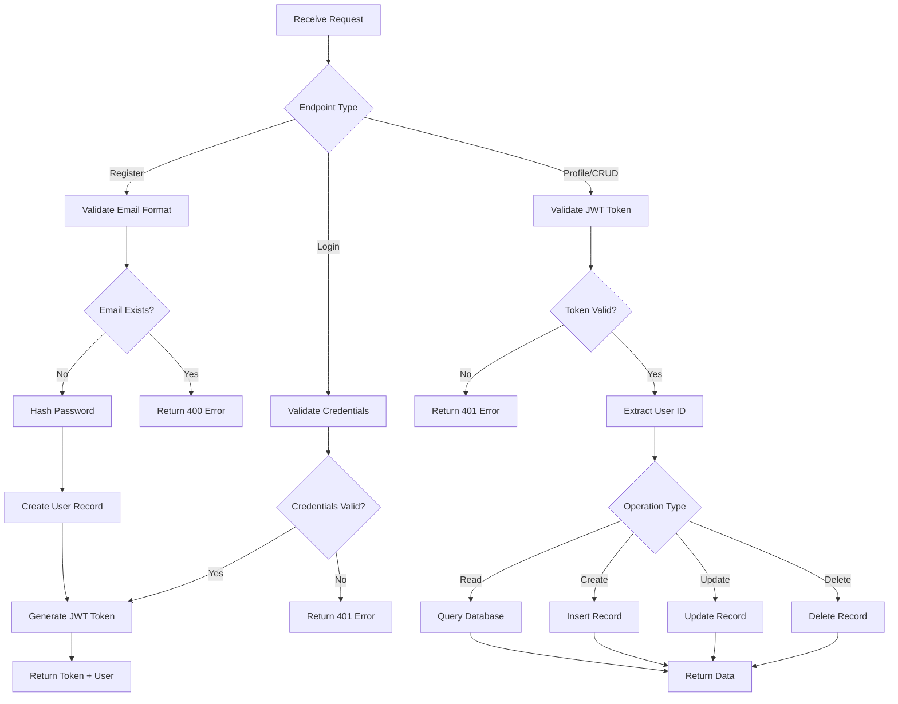

#### Parking Service Logic

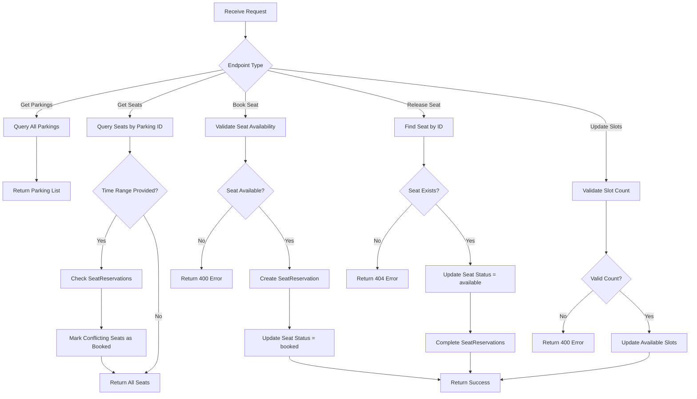

#### Reservation Service Logic

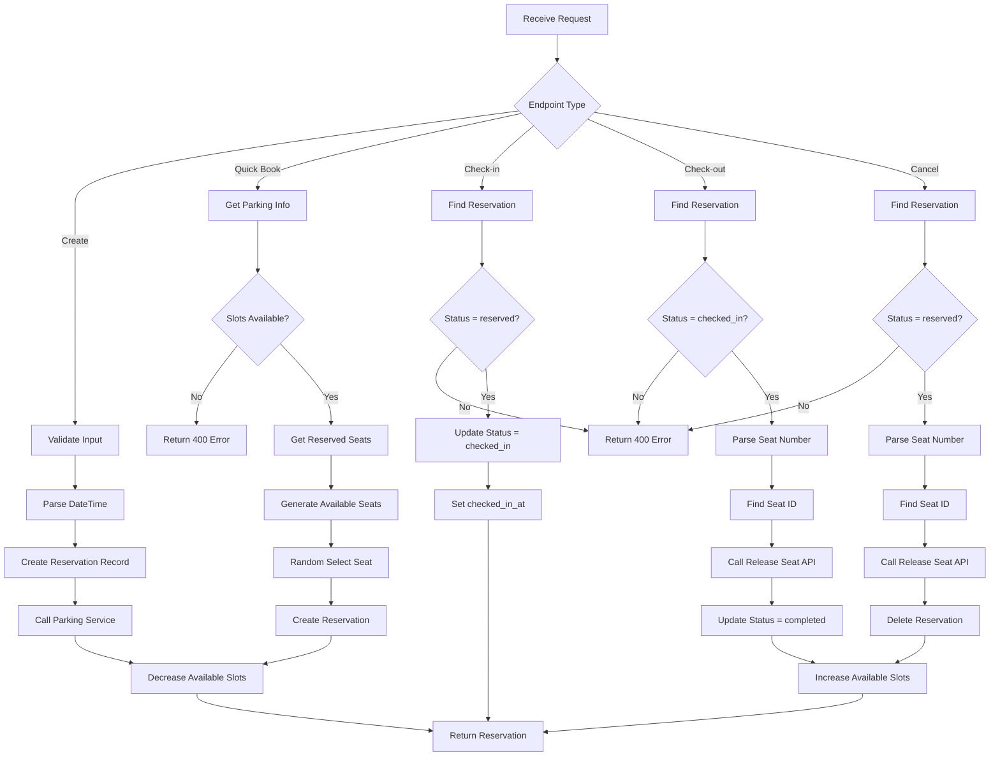

#### Payment Service Logic

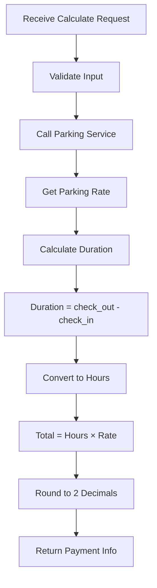

#### Recommendation Service Logic

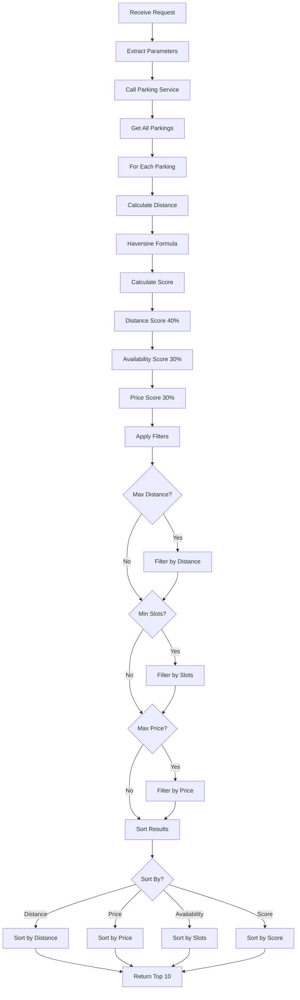

---

## Part 4 — Design Patterns Applied

### 4.1 Architectural Patterns

| Pattern | Implementation | Benefits |
|---------|---------------|----------|
| **Microservices** | 6 independent services (Auth, Parking, Reservation, Recommendation, Payment, Gateway) | Scalability, independent deployment, technology diversity |
| **API Gateway** | Single entry point routing to services | Simplified client, centralized auth, request aggregation |
| **Database per Service** | Each service has own SQLite database | Data isolation, loose coupling, independent schema evolution |
| **Saga Pattern** | Booking flow with compensating transactions | Distributed transaction management, eventual consistency |

### 4.2 Design Patterns

| Pattern | Implementation | Location |
|---------|---------------|----------|
| **Repository Pattern** | SQLAlchemy ORM abstracts database access | All services with databases |
| **Service Layer Pattern** | Business logic separated from API routes | `services/` directories |
| **DTO Pattern** | Pydantic schemas for data transfer | `schemas.py` files |
| **Factory Pattern** | Database session creation | `get_db()` dependency |
| **Strategy Pattern** | Multiple sorting strategies in recommendations | Recommendation Service |
| **Facade Pattern** | Gateway simplifies service interactions | API Gateway |

### 4.3 Security Patterns

| Pattern | Implementation | Purpose |
|---------|---------------|---------|
| **JWT Authentication** | Token-based stateless auth | Scalable authentication |
| **Password Hashing** | bcrypt for password storage | Secure credential storage |
| **Bearer Token** | Authorization header | Standard auth mechanism |
| **Token Validation** | Gateway validates before routing | Centralized security |

---

## Part 5 — Data Model

### 5.1 Entity Relationship Diagram

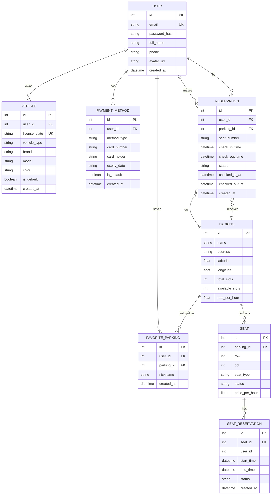

### 5.2 Database Distribution

**Auth Service Database (auth.db):**
- users
- vehicles
- payment_methods
- favorite_parkings

**Parking Service Database (parking.db):**
- parkings
- seats
- seat_reservations

**Reservation Service Database (reservation.db):**
- reservations

---

## Part 6 — Quality Attributes

### 6.1 Performance Metrics

| Metric | Target | Current Implementation |
|--------|--------|----------------------|
| API Response Time | < 2s | Achieved through efficient queries |
| Database Query Time | < 500ms | SQLite with indexed columns |
| Concurrent Users | 100+ | Async FastAPI with Uvicorn |
| Recommendation Calculation | < 1s | Optimized Haversine algorithm |

### 6.2 Reliability Measures

| Measure | Implementation |
|---------|---------------|
| Health Checks | All services expose `/health` endpoint |
| Error Handling | Try-catch blocks with proper HTTP status codes |
| Data Validation | Pydantic schemas validate all inputs |
| Transaction Management | Database transactions with rollback |
| Compensating Transactions | Seat release on cancel/checkout |

### 6.3 Security Measures

| Measure | Implementation |
|---------|---------------|
| Authentication | JWT tokens with HS256 algorithm |
| Password Security | bcrypt hashing with salt |
| Authorization | User ID extracted from JWT |
| Input Validation | Pydantic schemas prevent injection |
| CORS | Configured for frontend domain |

---

## Part 7 — Testing Strategy (Future Implementation)

### 7.1 Unit Testing
- Test individual service methods
- Mock external dependencies
- Coverage target: 80%

### 7.2 Integration Testing
- Test service-to-service communication
- Test database operations
- Test API endpoints

### 7.3 End-to-End Testing
- Test complete user flows
- Test booking process
- Test payment flow

### 7.4 Performance Testing
- Load testing with 100+ concurrent users
- Stress testing for peak loads
- Response time monitoring

---

*Last Updated: 2024*
*Analysis Version: 1.0*
