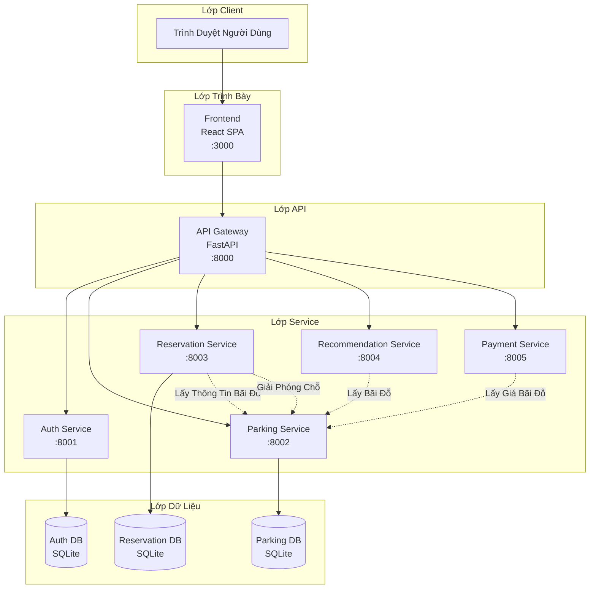

# System Architecture

---

## 1. Pattern Selection

| Pattern | Selected? | Business/Technical Justification |
|---------|-----------|----------------------------------|
| API Gateway | ✅ Có | Điểm vào tập trung cho tất cả các yêu cầu từ client. Xử lý định tuyến, xác thực và các vấn đề xuyên suốt. Đơn giản hóa logic phía client bằng cách cung cấp giao diện thống nhất. |
| Database per Service | ✅ Có | Mỗi microservice (Auth, Parking, Reservation) có database SQLite riêng. Đảm bảo khớp nối lỏng lẻo, triển khai độc lập và cô lập dữ liệu. |
| Shared Database | ❌ Không | Không sử dụng. Mỗi service duy trì database riêng để đảm bảo tính tự chủ và tránh khớp nối chặt chẽ. |
| Saga | ✅ Có | Được triển khai cho luồng đặt chỗ: đặt chỗ → tạo reservation → cập nhật parking slots. Sử dụng mẫu điều phối với giao dịch bù trừ (hủy/checkout giải phóng chỗ). |
| Event-driven / Message Queue | ❌ Không | Chưa triển khai. Các service giao tiếp qua HTTP/REST đồng bộ. Có thể thêm cho thông báo bất đồng bộ trong tương lai. |
| CQRS | ❌ Không | Không cần thiết cho quy mô hiện tại. Các thao tác CRUD đơn giản là đủ. |
| Circuit Breaker | ❌ Không | Chưa triển khai. Có thể thêm cho khả năng phục hồi production sử dụng thư viện như resilience4j hoặc Hystrix. |
| Service Registry / Discovery | ❌ Không | Các service sử dụng tên DNS tĩnh trong mạng Docker. Cho production, có thể dùng Consul hoặc Eureka. |
| JWT Authentication | ✅ Có | Xác thực không trạng thái sử dụng JWT tokens. Gateway xác thực token trước khi định tuyến yêu cầu đến các service. |
| Thuật Toán Gợi Ý Thông Minh | ✅ Có | Hệ thống tính điểm đa yếu tố (khoảng cách 40%, khả dụng 30%, giá 30%) sử dụng công thức Haversine cho định vị địa lý. |

---

## 2. System Components

| Component     | Responsibility | Tech Stack      | Port  |
|---------------|----------------|-----------------|-------|
| **Frontend** | Giao diện người dùng cho đặt chỗ đỗ xe, quản lý hồ sơ, đặt chỗ | React 18.2, Vite, React Router, Axios | 3000 |
| **API Gateway** | Định tuyến yêu cầu, xác thực JWT, điều phối service | Python FastAPI, httpx, PyJWT | 8000 |
| **Auth Service** | Xác thực người dùng, hồ sơ, xe, phương thức thanh toán, yêu thích | Python FastAPI, SQLAlchemy, bcrypt, PyJWT | 8001 |
| **Parking Service** | Quản lý bãi đỗ xe, quản lý chỗ đỗ, theo dõi khả dụng | Python FastAPI, SQLAlchemy | 8002 |
| **Reservation Service** | Quản lý đặt chỗ, check-in/out, đặt nhanh, giải phóng chỗ | Python FastAPI, SQLAlchemy, httpx | 8003 |
| **Recommendation Service** | Gợi ý bãi đỗ thông minh dựa trên vị trí, giá, khả dụng | Python FastAPI, httpx, thuật toán Haversine | 8004 |
| **Payment Service** | Tính toán thanh toán, ước tính chi phí | Python FastAPI, httpx | 8005 |
| **Database (Auth)** | Dữ liệu người dùng, xe, phương thức thanh toán, yêu thích | SQLite | - |
| **Database (Parking)** | Bãi đỗ xe, chỗ đỗ, đặt chỗ | SQLite | - |
| **Database (Reservation)** | Đặt chỗ người dùng, lịch sử đặt chỗ | SQLite | - |

---

## 3. Communication

### Inter-service Communication Matrix

| Từ → Đến | Auth | Parking | Reservation | Recommendation | Payment | Gateway |
|-----------|------|---------|-------------|----------------|---------|---------|
| **Frontend** | - | - | - | - | - | HTTP/REST |
| **Gateway** | HTTP/REST | HTTP/REST | HTTP/REST | HTTP/REST | HTTP/REST | - |
| **Auth Service** | - | - | - | - | - | - |
| **Parking Service** | - | - | - | - | - | - |
| **Reservation Service** | - | HTTP/REST | - | - | - | - |
| **Recommendation Service** | - | HTTP/REST | - | - | - | - |
| **Payment Service** | - | HTTP/REST | - | - | - | - |

---

## 4. Architecture Diagram

> Place diagrams in `docs/asset/` and reference here.



---

## 5. Deployment

Tất cả các service được đóng gói và điều phối bằng Docker Compose:

```yaml
services:
  - frontend (React + Vite) :3000
  - gateway (FastAPI) :8000
  - auth-service (FastAPI) :8001
  - parking-service (FastAPI) :8002
  - reservation-service (FastAPI) :8003
  - recommendation-service (FastAPI) :8004
  - payment-service (FastAPI) :8005
```

**Lệnh Triển Khai:**
```bash
# Build và khởi động tất cả services
docker compose up --build

# Khởi động ở chế độ nền
docker compose up -d

# Dừng tất cả services
docker compose down

# Xem logs
docker compose logs -f [tên-service]
```

**Cấu Hình Mạng:**
- Tất cả services chạy trong mạng Docker chung
- Các service giao tiếp sử dụng tên service làm DNS
- Frontend proxy các yêu cầu API đến gateway
- Gateway định tuyến đến các service nội bộ

**Volume Mounts:**
- Mã nguồn được mount để hot-reload trong quá trình phát triển
- Các file database được lưu trữ trong thư mục service
- Node modules được loại trừ khỏi frontend mount
